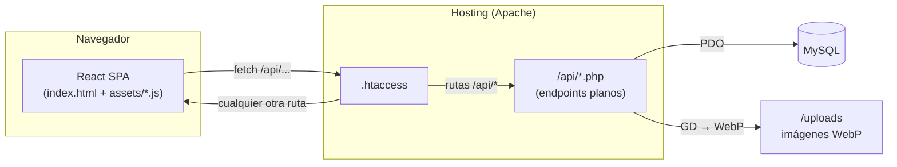
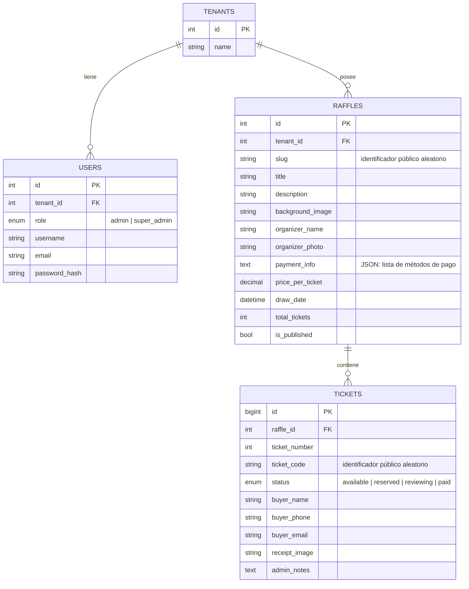

# 🎟️ TicketVault

**TicketVault** es una plataforma para crear y administrar rifas/sorteos por números, de principio a fin: generación automática de talonarios de hasta 10,000 boletos, venta y reserva en tiempo real, verificación de participación y comprobantes digitales con código QR — todo pensado para poder operar varias rifas de varios organizadores distintos (multi-tenant) desde una sola instalación.

Es una aplicación **React (frontend) + PHP plano (backend) + MySQL**, pensada para desplegarse en hosting compartido tipo Hostinger, sin frameworks de backend ni build-step en el servidor.

---

## Tabla de contenido

- [¿Qué hace la plataforma?](#qué-hace-la-plataforma)
- [Stack tecnológico](#stack-tecnológico)
- [Arquitectura](#arquitectura)
- [Modelo de datos](#modelo-de-datos)
- [Conceptos clave](#conceptos-clave)
- [Estructura del repositorio](#estructura-del-repositorio)
- [Puesta en marcha local](#puesta-en-marcha-local)
- [Despliegue](#despliegue)
- [Referencia de la API](#referencia-de-la-api)
- [Notas de seguridad](#notas-de-seguridad)
- [Roadmap](#roadmap)

---

## ¿Qué hace la plataforma?

### Para quien compra un número (público, sin cuenta)

- Ve la grilla de números de una rifa (`/sorteo/:slug`), con cuenta regresiva hasta la fecha del sorteo, imagen de fondo desenfocada, descripción y precio.
- Selecciona uno o varios números a la vez (o pide que se los elija al azar), reserva con su nombre/teléfono/correo, y recibe al instante un **boleto digital** propio para cada número: `/ticket/:code`, con su **código QR**, enlace para compartir, estado (Apartado / Revisando / Pagado), los demás números que compró en la misma rifa, el método de pago del organizador, y la opción de **descargar un comprobante en PDF**.
- Puede **verificar su participación** en cualquier momento buscando por número de boleto, correo o teléfono (menú ☰), sin necesidad de guardar el enlace.
- Rifas grandes (más de 1000 boletos) se paginan en bloques de 1000 para no cargar toda la grilla de una vez.

### Para quien organiza la rifa (panel de administración)

- Se registra con su negocio, usuario, correo y contraseña — cada cuenta es su propio espacio de trabajo (**multi-tenant**: no ve ni puede tocar las rifas de otra cuenta).
- Crea rifas de 2, 3 o 4 cifras (100 / 1,000 / 10,000 números), con imagen de fondo, descripción, foto y nombre del organizador, y uno o varios **métodos de pago** (efectivo, transferencia, Zelle, etc., cada uno con sus propios datos como número de cuenta).
- Publica/oculta y edita cada rifa desde una sección de **Ajustes** dedicada.
- Ve el progreso de venta con un anillo de progreso, estadísticas (recaudado, disponibles, apartados, en revisión, validados) y la lista de participantes con **buscador** (nombre/teléfono/número) y **paginación**.
- Por cada participante puede: cambiar su estado entre **Apartado → Revisando → Validado**, subir el comprobante de pago que le envíen (se optimiza a WebP automáticamente), dejar notas privadas, contactarlo por WhatsApp o llamada con un clic, abrir su boleto digital, o liberar el número.

### Para el dueño de la plataforma (Super Admin)

- Una vista de solo lectura (`/superadmin`) con **todas las cuentas registradas** y **todas las rifas de cada una**, sin necesidad de iniciar sesión en cada cuenta por separado.

---

## Stack tecnológico

| Capa | Tecnología | Uso |
|---|---|---|
| Frontend | **React 19** + **Vite** | SPA, todo el panel público y de administración |
| Enrutado | **React Router 7** | Rutas del lado del cliente |
| Estilos | **Tailwind CSS 3** (modo `class` para dark mode) | Todo el diseño, sin CSS a medida salvo excepciones puntuales |
| Animación | **GSAP** + `@gsap/react` | Transiciones, countdown, entradas de tarjetas, micro-interacciones |
| Iconos | **lucide-react** | Todo el set de íconos de la interfaz |
| Código QR | **qrcode** | Genera el QR del boleto digital como SVG, en el navegador |
| PDF | **jsPDF** + **html2canvas-pro** | Exporta el boleto digital a PDF (cargadas de forma diferida: solo pesan cuando se usa el botón) |
| Backend | **PHP** (sin framework) | Cada endpoint es un archivo plano en `/api` |
| Base de datos | **MySQL** vía **PDO** | Prepared statements en todo el backend |
| Imágenes | **GD** (extensión de PHP) | Optimiza toda imagen subida a **WebP** |
| Hosting | Apache + `.htaccess` (pensado para Hostinger) | Sirve el build de React y enruta `/api/*` a PHP |

No hay Composer, no hay `npm` en el servidor: el **build de React se genera localmente y se sube ya compilado** (ver [Despliegue](#despliegue)).

---

## Arquitectura



- **Una sola SPA de React** cubre tanto el sitio público (landing, grilla de rifa, boleto digital) como el panel de administración — todo vive bajo `react-router-dom`, diferenciando vistas públicas de protegidas con [`ProtectedRoute.jsx`](frontend/src/components/ProtectedRoute.jsx).
- **Sin API REST "de verdad"**: cada acción es un archivo PHP independiente en `/api` (p. ej. `reserve_ticket.php`, `admin_mark_paid.php`) que recibe JSON o `multipart/form-data`, habla con MySQL por PDO, y devuelve JSON. `.htaccess` deja pasar `/api/*` directo a PHP y manda todo lo demás a `index.html` para que React Router resuelva la ruta.
- **Sesión de PHP** (`$_SESSION`) es el único mecanismo de autenticación — sin JWT ni tokens. [`auth.php`](api/auth.php) centraliza `require_auth()` (sesión válida + expiración por inactividad de 1 hora) y el aislamiento entre cuentas (ver abajo).

---

## Modelo de datos



Definición completa (con los `ALTER TABLE` de migración) en [`database.sql`](database.sql).

**Por qué `tenants` existe aparte de `users`**: cada cuenta registrada (`users`) pertenece a un `tenant`, que es quien realmente "posee" las rifas (`raffles.tenant_id`). Esto deja la puerta abierta a que un mismo negocio tenga varios usuarios con acceso al mismo tenant en el futuro, sin tocar el resto del modelo.

---

## Conceptos clave

### Multi-tenancy y control de acceso

Cada rifa pertenece a un `tenant_id`. Todos los endpoints de administración que reciben un `raffle_id` llaman a `assert_raffle_ownership($pdo, $raffle_id)` ([`api/auth.php`](api/auth.php)) antes de tocar cualquier dato: si la rifa no pertenece al tenant de la sesión activa, corta la petición con `403`. Los listados (`admin_get_raffles.php`, etc.) filtran directamente por `WHERE tenant_id = ?`.

El rol `super_admin` **no tiene `tenant_id`** de forma restrictiva: `is_super_admin()` hace que `assert_raffle_ownership` no bloquee nada, así que esa cuenta ve y administra todo. Es también la única que puede entrar a `/superadmin`.

### Identificadores públicos aleatorios (no numéricos)

Tanto la URL de una rifa (`raffles.slug`) como la de cada boleto (`tickets.ticket_code`) son cadenas aleatorias de 24 caracteres (`a-z0-9`), generadas y verificadas como únicas en [`api/slug_helper.php`](api/slug_helper.php). La razón: con IDs numéricos autoincrementales, cualquiera podría "adivinar" otra rifa o boleto ajeno subiendo o bajando un número en la URL. Los IDs numéricos internos (`raffles.id`, `tickets.id`) nunca se exponen en una URL pública — solo se usan puertas adentro, entre el backend y las llamadas ya autenticadas del panel.

### Ciclo de vida de un boleto

```
available → reserved (Apartado) → reviewing (Revisando) → paid (Validado)
```

- El comprador selecciona números disponibles y los reserva → pasan a `reserved`.
- El organizador, al recibir el comprobante de pago, puede pasarlo a `reviewing` mientras lo revisa, y finalmente a `paid` cuando lo valida — o liberar el número de vuelta a `available` si el comprador no completa la compra.
- La reserva usa **bloqueo pesimista** (`SELECT ... FOR UPDATE` dentro de una transacción, en [`api/reserve_ticket.php`](api/reserve_ticket.php)) para que dos personas no puedan reservar el mismo número al mismo tiempo, incluso si envían la reserva en el mismo instante.

### Boleto digital + QR + PDF

Al reservar, cada número recibe su propio `ticket_code`. Con eso se arma la página `/ticket/:code` ([`TicketPage.jsx`](frontend/src/components/TicketPage.jsx)): el QR (librería `qrcode`) simplemente codifica esa misma URL, así que escanearlo lleva directo al boleto. El botón "Descargar comprobante" usa `html2canvas-pro` para capturar la tarjeta tal cual se ve en pantalla y `jsPDF` para convertirla en PDF — ambas librerías se cargan con `import()` dinámico, así que solo pesan para quien realmente aprieta ese botón.

### Imágenes optimizadas a WebP

Toda imagen que se sube (fondo de rifa, foto del organizador, comprobante de pago) pasa por [`api/image_helper.php`](api/image_helper.php): se valida, se redimensiona si supera 1920px, y se guarda como `.webp` con la librería GD de PHP — nunca se guarda el archivo original tal cual se subió.

### Métodos de pago

`raffles.payment_info` guarda un **arreglo JSON** de métodos de pago (no uno solo): cada uno con su método (Transferencia, Efectivo, Zelle...), institución, una lista libre de "datos" (número de cuenta, cédula, alias, etc.) y una descripción opcional. Se editan desde Ajustes de la rifa y se muestran al público en el popup de "Pagos", con botón de copiar en cada dato.

---

## Estructura del repositorio

```
rifas100/
├── api/                        # Backend: un archivo PHP por acción
│   ├── auth.php                 # Sesión, helpers de tenant/rol, ownership
│   ├── db.php                   # Conexión PDO
│   ├── image_helper.php         # Pipeline compartido de optimización a WebP
│   ├── slug_helper.php          # Generador de slugs/códigos únicos
│   ├── login.php / register.php / logout.php / me.php
│   ├── admin_*.php              # Endpoints del panel (requieren sesión)
│   ├── superadmin_overview.php  # Solo super_admin
│   └── get_tickets.php / get_ticket.php / reserve_ticket.php /
│       random_tickets.php / verify_participation.php   # Endpoints públicos
│
├── frontend/                   # Código fuente de la SPA (React + Vite)
│   ├── src/components/          # Un componente por página/modal
│   ├── src/utils/                # Helpers puros de JS (p. ej. parseo de payment_info)
│   ├── package.json
│   └── vite.config.js
│
├── uploads/                     # Imágenes subidas (WebP), generado en tiempo de ejecución
├── database.sql                 # Esquema completo + migraciones ALTER comentadas
├── .htaccess                    # Enrutado de Apache (API vs. SPA)
├── index.html                   # ⚠️ Build de producción ya compilado (ver Despliegue)
└── assets/                      # ⚠️ JS/CSS del build de producción ya compilado
```

### Componentes del frontend, por área

| Área | Componentes |
|---|---|
| Público | `Landing`, `TicketGrid`, `TicketPage`, `NotFound` |
| Popups públicos | `OrganizerModal`, `PaymentInfoModal`, `VerifyParticipationModal`, `AccountMenuSection` |
| Auth | `Admin` (login), `Register`, `ProtectedRoute` |
| Panel por rifa | `AdminRaffle` (estadísticas + participantes), `AdminRaffleSettings`, `AdminRaffleSidebar`, `ParticipantModal`, `RaffleFormModal`, `PaymentMethodModal` |
| Super admin | `SuperAdmin` |
| Utilitarios | `ThemeToggle`, `Dialog` (reemplaza `alert`/`confirm`), `TicketQRCode` |

---

## Puesta en marcha local

### Requisitos

- Node.js 18+ (para el frontend)
- PHP 8+ con extensiones **PDO MySQL** y **GD** (con soporte WebP)
- MySQL / MariaDB

### 1. Base de datos

```bash
mysql -u root -p < database.sql
```

### 2. Backend

Edita [`api/db.php`](api/db.php) con las credenciales de tu base local, y sirve la carpeta con el servidor embebido de PHP:

```bash
php -S localhost:8000
```

### 3. Frontend (modo desarrollo)

```bash
cd frontend
npm install
npm run dev
```

Como el backend real vive en PHP (no en el servidor de Vite), en desarrollo conviene apuntar el `fetch` a `http://localhost:8000` o configurar un proxy en `vite.config.js` — el código actual asume rutas relativas (`/api/...`), pensadas para producción donde front y backend comparten el mismo dominio.

---

## Despliegue

Este repo **no tiene CI/CD**: el despliegue es manual y tiene una particularidad importante.

`index.html` y `/assets` en la **raíz del repositorio** son el build de producción ya compilado — son los archivos que Apache realmente sirve (ver `.htaccess`). `frontend/dist/` (lo que genera `vite build`) **no se sirve directamente**: hay que copiarlo a la raíz después de cada cambio en el frontend.

Flujo después de tocar cualquier cosa en `frontend/src`:

```bash
cd frontend
npm run build

# Windows / PowerShell o Git Bash, desde la raíz del repo:
rm -f assets/*.js assets/*.css
cp frontend/dist/index.html index.html
cp frontend/dist/assets/* assets/
```

Luego se sube (`git push`) y se sincroniza al hosting. Si un cambio no aparece en producción, la causa más común es justamente **olvidar este paso** — el código puede estar perfectamente commiteado y aun así no reflejarse, porque el navegador sigue cargando el bundle viejo referenciado en el `index.html` de la raíz.

### Migraciones de base de datos

`database.sql` no se vuelve a correr completo en producción: cada cambio de esquema se agregó como comentario `-- ALTER TABLE ...` justo debajo de la tabla correspondiente. Hay que aplicarlos a mano, en orden, contra la base ya existente.

---

## Referencia de la API

Todos los endpoints devuelven JSON con al menos `{ success: boolean }`.

### Públicos (sin sesión)

| Endpoint | Método | Qué hace |
|---|---|---|
| `get_tickets.php` | GET | Datos de una rifa + una página de boletos (por `slug`) |
| `get_ticket.php` | GET | Datos completos de un boleto digital (por `ticket_code`) |
| `reserve_ticket.php` | POST | Reserva uno o varios números a la vez |
| `random_tickets.php` | GET | Sortea N números disponibles al azar |
| `verify_participation.php` | GET | Busca boletos por número, correo o teléfono |
| `login.php` / `register.php` / `logout.php` | POST | Autenticación |

### Panel de administración (requieren sesión)

| Endpoint | Qué hace |
|---|---|
| `me.php` | Identidad de la sesión actual (usuario, rol, tenant) |
| `admin_get_raffles.php` / `admin_create_raffle.php` / `admin_update_raffle.php` / `admin_delete_raffle.php` / `admin_toggle_raffle.php` | CRUD de rifas |
| `admin_upload_raffle_image.php` | Sube fondo u foto del organizador (WebP) |
| `admin_update_payment_info.php` | Guarda los métodos de pago de la rifa |
| `admin_dashboard.php` | Estadísticas + lista de participantes de una rifa |
| `admin_mark_paid.php` | Cambia el estado de un boleto (Apartado/Revisando/Validado) |
| `admin_delete_buyer.php` | Libera un boleto |
| `admin_update_ticket_notes.php` / `admin_upload_ticket_receipt.php` | Notas privadas y comprobante de un boleto |
| `admin_backfill_slugs.php` | Utilidad: genera `slug` a rifas que no lo tengan |
| `my_raffle_access.php` | ¿La sesión actual es dueña de esta rifa? (para el menú del sitio público) |
| `superadmin_overview.php` | Todas las cuentas y rifas — solo `super_admin` |

---

## Notas de seguridad

- Contraseñas con `password_hash()` / `password_verify()` de PHP (bcrypt).
- Todas las consultas usan **prepared statements** de PDO.
- Cada endpoint de administración valida la sesión (`require_auth()`) y la pertenencia de la rifa al tenant (`assert_raffle_ownership()`) antes de leer o escribir nada.
- Los datos personales del comprador (teléfono, y el código del boleto) se muestran **enmascarados** en los endpoints públicos de verificación — solo se ven completos dentro del panel de administración o en el propio boleto digital de esa persona.
- Las imágenes subidas se validan con `getimagesize()` y se reprocesan por completo con GD antes de guardarse (nunca se guarda el archivo tal cual llegó).
- Sesión con expiración por inactividad de 1 hora.

---

## Roadmap

Cosas explícitamente pensadas pero no incluidas todavía:

- **Inicio de sesión con Google.**
- **Planes de suscripción** para limitar funciones según el plan de cada tenant (la base multi-tenant ya está lista para esto).
- Que el **comprador pueda subir su propio comprobante** de pago desde el boleto digital (hoy solo lo puede subir el organizador desde el panel).
